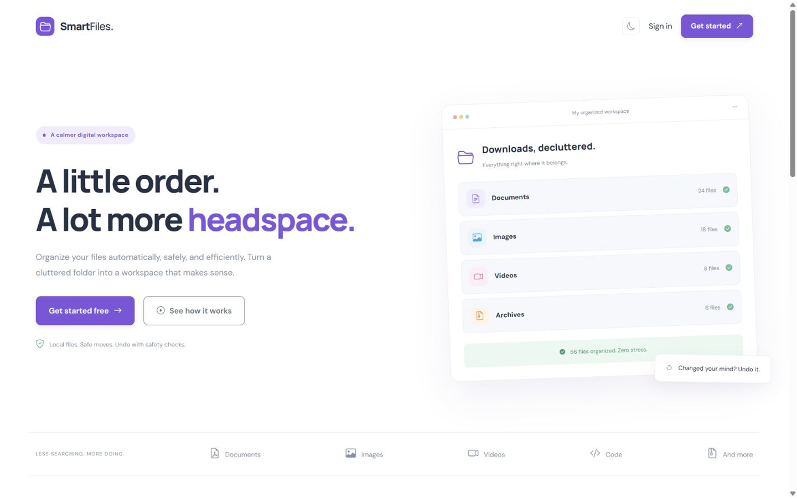
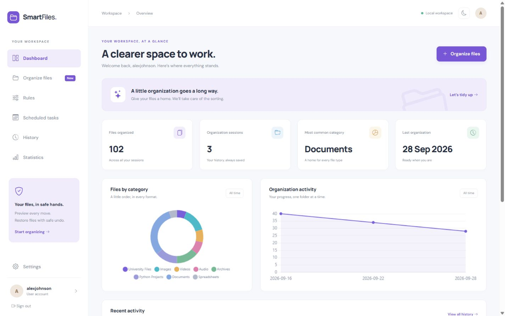
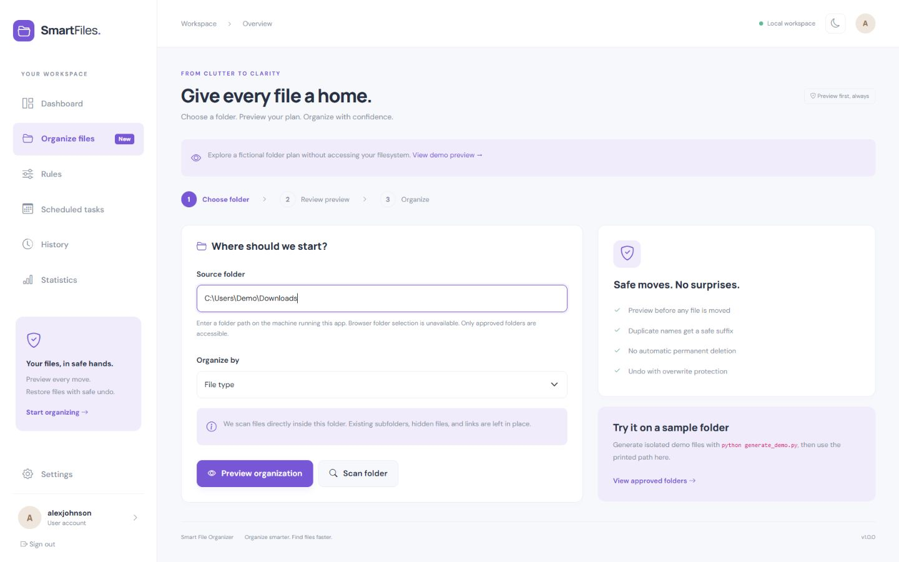
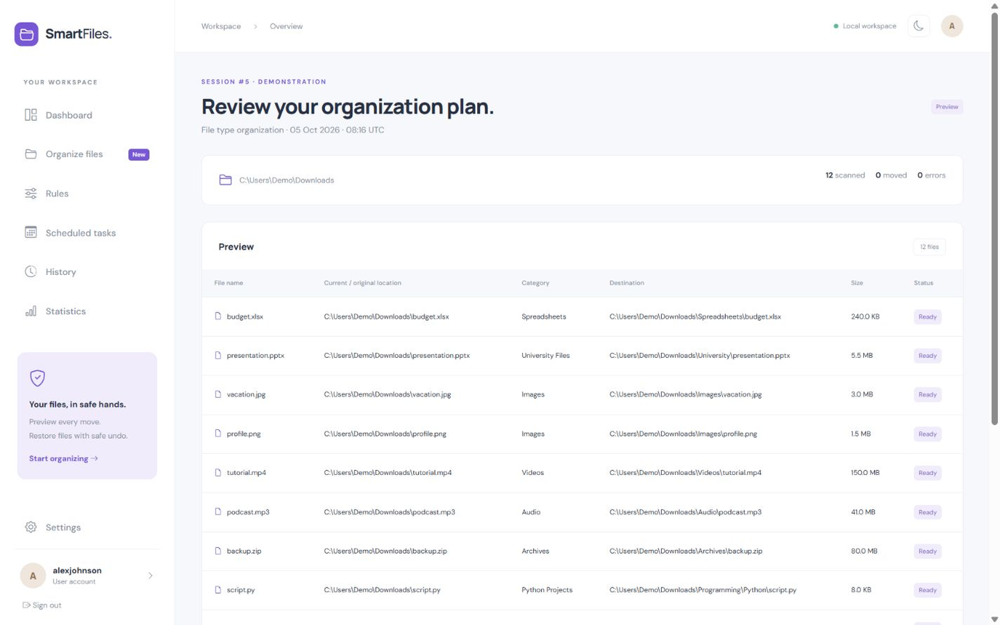
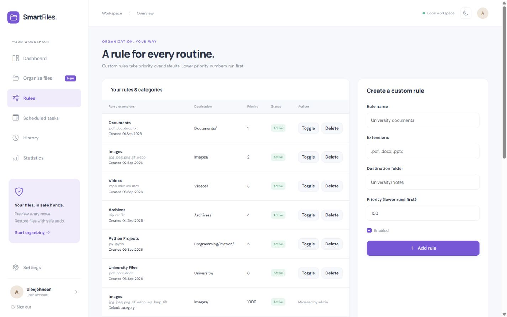
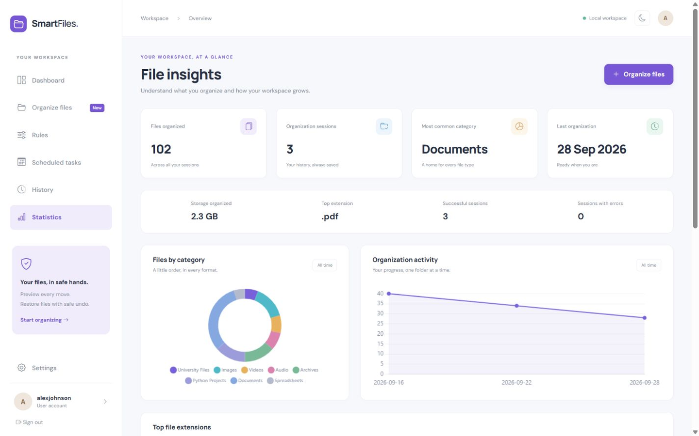
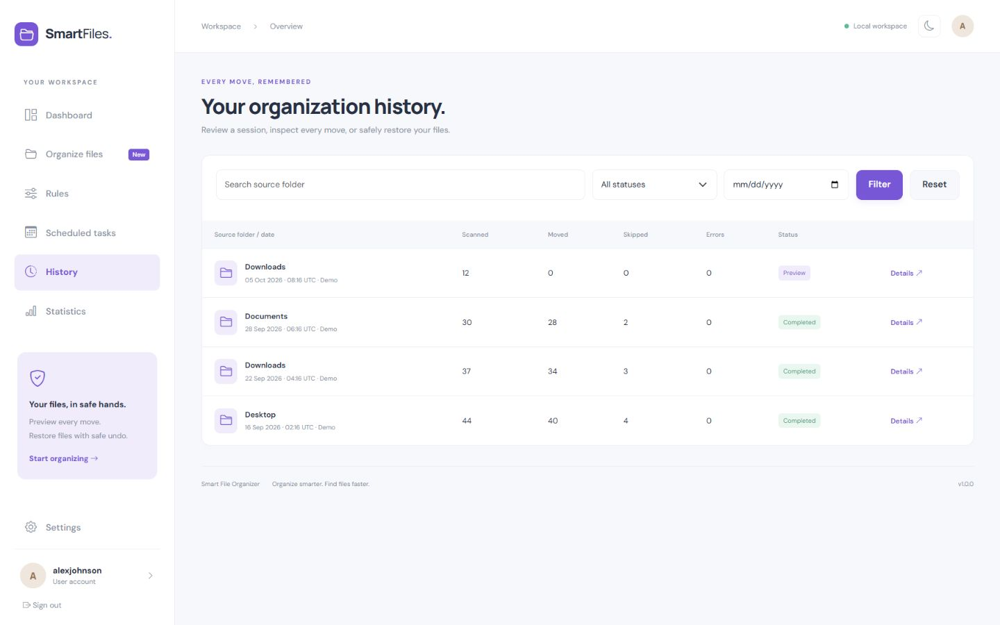
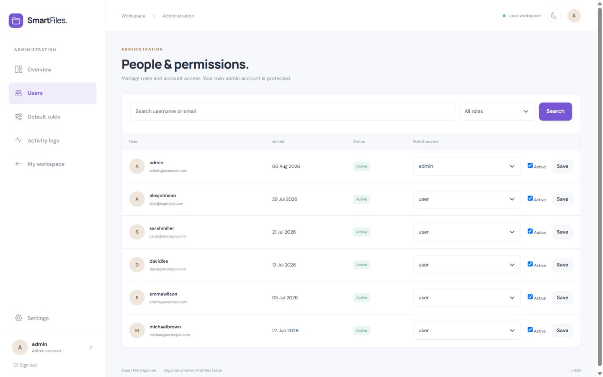
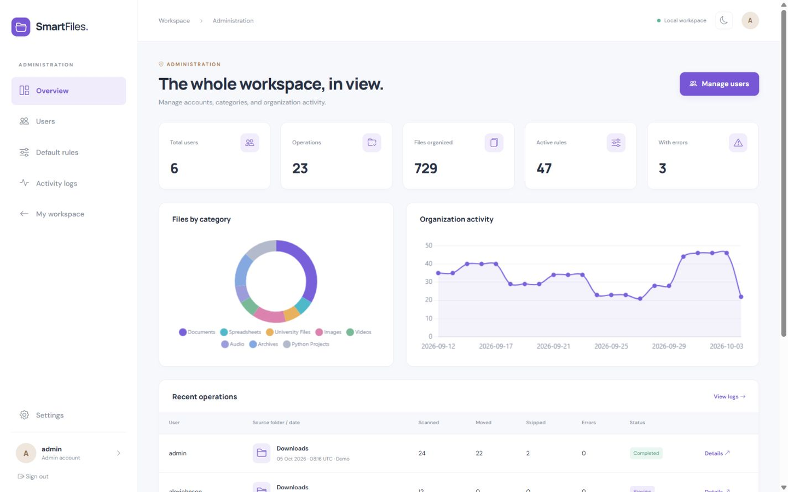

# Smart File Organizer

**A modern Flask-based file management and automation platform that safely organizes files using customizable rules, scheduling, analytics, preview mode, and undo support.**

[](https://www.python.org/)
[](https://flask.palletsprojects.com/)
[](LICENSE)
[](https://github.com/AliAdilQ/smart-file-organizer/stargazers)
[](https://github.com/AliAdilQ/smart-file-organizer/forks)
[](https://github.com/AliAdilQ/smart-file-organizer/commits)
[](https://github.com/AliAdilQ/smart-file-organizer)

### Organize smarter. Find files faster.

Smart File Organizer is a modern Python Flask web application designed to automate
file organization safely and efficiently. Turn a cluttered local folder into a
clear workspace: review a plan, confirm moves, and keep a complete history.
Personal dashboards, customizable rules, scheduled routines, analytics, and
administrative controls come together in a responsive interface.

## Screenshots

Actual captures of the running application with seeded data. Displayed filesystem
paths belong to the fictional Demo user. Demo records are labelled and cannot
move files or be undone. See [the screenshot guide](docs/screenshots/README.md).




| File organizer | Preview organization |
| --- | --- |
|  |  |

| Rules management | Statistics |
| --- | --- |
|  |  |

| Organization history | Admin users |
| --- | --- |
|  |  |

See the full-width overview in [Admin Panel](#admin-panel).

## Features

- Organization by category, extension, modification year/month, and file size.
- Custom rules with validated relative destinations, priority, and active states.
- Saved previews / dry runs and confirmation before manual moves.
- Duplicate filename protection, safe renaming, change detection, and safe undo.
- Protected folders, normalized paths, no silent deletion, and no overwrites.
- Per-file details and searchable, filtered, paginated organization history.
- Daily, weekly, and monthly schedules processed by a separate local worker.
- Category, extension, storage, and activity analytics with Chart.js.
- Registration, login, profile updates, password hashing, CSRF, and role checks.
- Admin dashboards, user/role management, default rules, and activity logs.
- Responsive UI, light/dark mode, confirmation modals, alerts, loading and empty states.
- SQLite and PostgreSQL-ready SQLAlchemy configuration (additional driver required).
- Idempotent demo seeding, isolated fixtures, pytest coverage, and GitHub Actions CI.

## Tech Stack

| Layer | Technologies |
| --- | --- |
| Backend | Python 3.11+, Flask, Flask-SQLAlchemy, SQLAlchemy, Flask-Login, Flask-WTF, WTForms, Werkzeug |
| Frontend | HTML5, CSS3, Bootstrap 5, JavaScript, Chart.js, Bootstrap Icons |
| Database | SQLite; configurable SQLAlchemy database URL |
| Configuration | python-dotenv and environment variables |
| Testing | pytest |

No Node.js or React is required. Scheduling uses a dedicated worker, not a thread
inside the Flask development server.

## Installation

```bash
git clone https://github.com/AliAdilQ/smart-file-organizer.git
cd smart-file-organizer
```

Verify Python **3.11+** with `python --version`.

### Windows PowerShell

```powershell
python -m venv venv
.\venv\Scripts\Activate.ps1
python -m pip install -r requirements.txt
Copy-Item .env.example .env
```

For Command Prompt, use `venv\Scripts\activate.bat` and
`copy .env.example .env`. If PowerShell blocks activation, use
`venv\Scripts\python.exe` directly instead of changing global execution policy.

### macOS / Linux

```bash
python3 -m venv venv
source venv/bin/activate
python -m pip install -r requirements.txt
cp .env.example .env
```

### Initialize, seed, and run

```bash
python -m flask --app run.py init-db
python seed.py
python run.py
```

Open [http://127.0.0.1:5000](http://127.0.0.1:5000).

`seed.py` also initializes a fresh database. The existing CLI command
`python -m flask --app run.py seed-demo` remains available. Initialization upgrades
the older schedule table by adding names and a demo flag, preserving existing data.
If port 5000 is occupied, use:

```bash
python -m flask --app run.py run --host 127.0.0.1 --port 5056
```

## Environment Configuration

`.env` is ignored. Default storage is `instance/organizer.db`. Local development
generates a persistent random secret in the ignored instance directory when
`SECRET_KEY` is unset. Paths refer to the **machine running Flask**, not browser
uploads. Only `demo_files/sample_downloads/` is approved by default.

To try actual organization, run `python generate_demo.py` and paste its printed
path into the organizer. These are text-only fixtures regardless of extension.
The generator never overwrites files. They are separate from fictional seed paths.

Approve additional folders with comma-separated absolute paths in `ORGANIZER_ROOTS`.
For example, `ORGANIZER_ROOTS=C:/Users/Demo/Downloads` or
`ORGANIZER_ROOTS=/home/demo/Downloads`, replacing the fictional Demo path with a
folder explicitly approved by the machine owner. Restart app and worker. Folder
names containing commas are not supported by this configuration.

For PostgreSQL, install an appropriate driver such as `psycopg[binary]` and use
the `postgresql+psycopg` scheme in `DATABASE_URL`. SQLite is the verified default.
For future schema changes, use migration tooling rather than relying on `create_all`.

Non-demo deployment requires `APP_ENV=production`, a random `SECRET_KEY` of at least
32 characters, HTTPS, and a production WSGI server. Demo seeding refuses production.
The built-in server is for local development; see [Flask's deployment guide](https://flask.palletsprojects.com/en/stable/deploying/).
Create a non-demo admin with `python -m flask --app run.py create-admin`.

## Demo Credentials

**These credentials are intended for local development and portfolio demonstration
only. Change or remove them before deploying the application publicly.**

| Role | Username | Email | Password |
| --- | --- | --- | --- |
| Administrator | `admin` | `admin@example.com` | `Admin123!` |
| User | `alexjohnson` | `alex@example.com` | `User123!` |
| User | `sarahmiller` | `sarah@example.com` | `User123!` |
| User | `davidlee` | `david@example.com` | `User123!` |
| User | `emmawilson` | `emma@example.com` | `User123!` |
| User | `michaelbrown` | `michael@example.com` | `User123!` |

Passwords are Werkzeug scrypt hashes. Plain demo passwords appear only in this
section; seed data stores hashes produced using the existing password-hashing
method. Logs and seed output do not reveal passwords.

A fresh seed contains **6 active demo accounts, 24 organization sessions, 873
file records, 36 personal rules, 18 demo schedules, and 56 audit logs**, plus
11 default categories. Most sessions succeed; partial/failed sessions show realistic
outcomes. One saved illustrative preview is available to alexjohnson from the
organizer page. Demo schedules can display Active but are never run by the worker.

Repeated seeding does not duplicate records. Existing accounts occupying demo
usernames/emails are skipped safely unless created by this seed. Existing non-demo
passwords, roles, and active states are never reset. Untouched v1 seeded regular
accounts are migrated to the listed demo identities and hashes. Real history is preserved; legacy
illustrative histories use fictional paths, and positively identified v1 seed
fixtures are replaced by the refreshed dataset without touching files. Unrelated
records are retained, so upgraded databases may contain more records than fresh-demo totals. Use a dedicated
`DATABASE_URL` for clean screenshots without changing existing data.

## Organization Rules

Default categories: Images, Documents, Spreadsheets, Presentations, Videos, Audio,
Archives, Applications, Code, Ebooks, and Other. Extensions are case-insensitive;
unmatched files always go to Other.

Each demo account receives Documents (priority 1), Images (2), Videos (3), Archives
(4), Python Projects (5), and University Files (6). Lower numbers run first; ties
prefer personal rules, then database ID. A Documents rule matches PDFs before
University Files, while University Files still captures PPTX files. Nested folders
such as `Programming/Python` are supported.

Year/month modes use modification dates and produce `category/YYYY/` or
`category/YYYY/Month/`. Size groups use binary thresholds: Tiny <1 MiB, Small
1–10 MiB, Medium 10–100 MiB, Large 100 MiB–1 GiB, Very Large ≥1 GiB. Boundaries
belong to the larger group. Audit and schedule timestamps are UTC; modification
dates use server-local time. Scans are nonrecursive and capped at 5,000 entries.

## Safety Features

- Saved previews expire after 30 minutes and require confirmation for manual moves.
- No silent deletion: copy, flush, verify content, and preserve basic metadata
  before removing the source as part of a completed move. No delete action exists.
- Exclusive destination creation prevents overwrites. Collisions get numeric suffixes.
- Approved roots, path validation, protected system/source/credential folders, and
  symlink/junction checks restrict filesystem access.
- Undo restores unchanged files to unoccupied original locations. Conflicts or
  edited files stay in place; resolve conflicts and retry undo.
- Durable per-file journals record state before I/O. Hashes detect changes; content
  deduplication is a future feature. Empty category folders remain after undo.
- Demo sessions cannot execute or undo moves; the worker skips every demo task.

Copies need extra free space. A failed/interrupted copy may leave a destination
copy for manual review. Filesystem and database updates are not atomic. Interrupted
`running` / `undoing` sessions are not replayed automatically; review their recorded
paths and content before recovery.

## Scheduling

```bash
python worker.py
# Or invoke periodically through Windows Task Scheduler / cron:
python worker.py --once
```

Run one dedicated worker alongside Flask. Real schedules require explicit consent
and approved folders. The worker polls every 30 seconds, claims occurrences before
I/O, and skips inactive users and demo tasks. Daily/weekly intervals are 24 hours
and seven days; monthly uses calendar months and clamps invalid days. Missed runs
are coalesced; failures are recorded rather than automatically retried. Reactivation
resets the next run. Selected rules match files; unmatched files go to Other.

## Admin Panel



Administrators can manage users, roles, default rules, and account status; search
accounts; inspect organization histories and audit logs; and monitor category counts,
activity trends, failures, and statistics. System monitoring covers application
activity and operation outcomes, not OS hardware metrics.

Admins cannot deactivate/demote themselves; the last active administrator is protected.
Regular users are denied access. Admin session details are read-only; real moves
and undo require the session-owning account.

## Testing

```bash
python -m pytest -q
```

Tests use temporary directories and isolated databases. They cover authentication,
CSRF, permissions, ownership, rules, classification, safe paths, dry runs, collisions,
changed files, undo, schedules, schema upgrades, demo idempotence, and README links.
Symlink tests skip when the OS does not permit creating links. CI covers Windows
and Linux with Python 3.11 and 3.12.

## Project Structure

<!-- PROJECT_TREE_START -->
```text
smart-file-organizer/
├── .github/
│   └── workflows/
│       └── tests.yml
├── app/
│   ├── admin/
│   │   ├── __init__.py
│   │   └── routes.py
│   ├── auth/
│   │   ├── __init__.py
│   │   ├── forms.py
│   │   └── routes.py
│   ├── main/
│   │   ├── __init__.py
│   │   ├── analytics.py
│   │   └── routes.py
│   ├── organizer/
│   │   ├── __init__.py
│   │   ├── routes.py
│   │   ├── rules.py
│   │   └── services.py
│   ├── static/
│   │   ├── css/
│   │   │   └── style.css
│   │   ├── images/
│   │   │   └── favicon.svg
│   │   └── js/
│   │       ├── charts.js
│   │       ├── main.js
│   │       └── theme.js
│   ├── templates/
│   │   ├── admin/
│   │   │   ├── dashboard.html
│   │   │   ├── logs.html
│   │   │   ├── rules.html
│   │   │   └── users.html
│   │   ├── auth/
│   │   │   ├── forgot.html
│   │   │   └── form.html
│   │   ├── dashboard/
│   │   │   ├── history.html
│   │   │   ├── index.html
│   │   │   ├── profile.html
│   │   │   ├── rules.html
│   │   │   ├── schedules.html
│   │   │   └── settings.html
│   │   ├── organizer/
│   │   │   ├── detail.html
│   │   │   └── index.html
│   │   ├── base.html
│   │   ├── error.html
│   │   ├── landing.html
│   │   └── macros.html
│   ├── __init__.py
│   ├── audit.py
│   ├── demo.py
│   ├── extensions.py
│   ├── forms.py
│   ├── models.py
│   ├── scheduler.py
│   └── schema.py
├── demo_files/
│   └── README.md
├── docs/
│   └── screenshots/
│       ├── admin-dashboard.png
│       ├── admin-users.png
│       ├── dashboard.png
│       ├── history.png
│       ├── landing-page.png
│       ├── organizer.png
│       ├── preview.png
│       ├── README.md
│       ├── rules.png
│       └── statistics.png
├── instance/
│   └── .gitkeep
├── tests/
│   ├── conftest.py
│   ├── test_admin.py
│   ├── test_auth.py
│   ├── test_cli.py
│   ├── test_demo.py
│   ├── test_links.py
│   ├── test_organizer.py
│   ├── test_readme.py
│   ├── test_rules.py
│   └── test_scheduler.py
├── .env.example
├── .gitignore
├── CHANGELOG.md
├── config.py
├── CONTRIBUTING.md
├── generate_demo.py
├── LICENSE
├── pytest.ini
├── README.md
├── requirements.txt
├── run.py
├── SECURITY.md
├── seed.py
└── worker.py
```
<!-- PROJECT_TREE_END -->

The app factory configures extensions and blueprints; `organizer/services.py`
handles files; `main/analytics.py` supplies dashboards; `scheduler.py` handles due
tasks; `demo.py` seeds fictional data; `schema.py` performs the additive upgrade.
Databases, environments, logs, caches, and generated fixtures are ignored and
excluded from the publishable tree. Real screenshot PNGs are included.

## Limitations

- Intended for trusted local use. Approved roots are shared by accounts; ownership
  checks do not provide per-user OS filesystem isolation.
- Use one web process and one worker. Avoid overlapping jobs or concurrent edits;
  hostile directory-entry swapping is outside the path-check security model.
- Password recovery is an assistance page; email reset is not configured.
- Bootstrap, icons, fonts, and Chart.js use CDNs; styling needs internet.
- No recursive scanning, native folder picker, browser folder uploads, or content
  deduplication. Large files take time to hash and need temporary copy space.
- ACLs, extended attributes, and hard-link topology are not preserved.
- Public hosting needs additional operational controls, rate limiting, and per-user
  filesystem permissions. SQLite is the verified default database.

## Future Improvements

AI-powered file classification, Google Drive integration, cloud storage support,
duplicate content detection using hashes, REST API, Docker support, React frontend,
desktop application, advanced scheduling, and interrupted-session recovery.
These are future enhancements, not current features.

## Contributing

See [CONTRIBUTING.md](CONTRIBUTING.md). Report vulnerabilities privately following
[SECURITY.md](SECURITY.md). Release notes are in [CHANGELOG.md](CHANGELOG.md).

## License

[MIT License](LICENSE). Copyright © 2026 AliAdilQ.

## Repository Description and Topics

**Description:** Modern Flask-based file organizer with custom rules, scheduling,
analytics, admin dashboard, preview mode and safe undo functionality.

**Topics:** `python`, `flask`, `automation`, `file-organizer`, `file-management`,
`bootstrap`, `sqlite`, `sqlalchemy`, `python-project`, `web-application`,
`productivity`, `portfolio`, `pytest`.

## Author

**AliAdilQ**

- GitHub: [AliAdilQ](https://github.com/AliAdilQ)
- Repository: [smart-file-organizer](https://github.com/AliAdilQ/smart-file-organizer)

If you find this project useful, consider giving it a ⭐ on GitHub.
